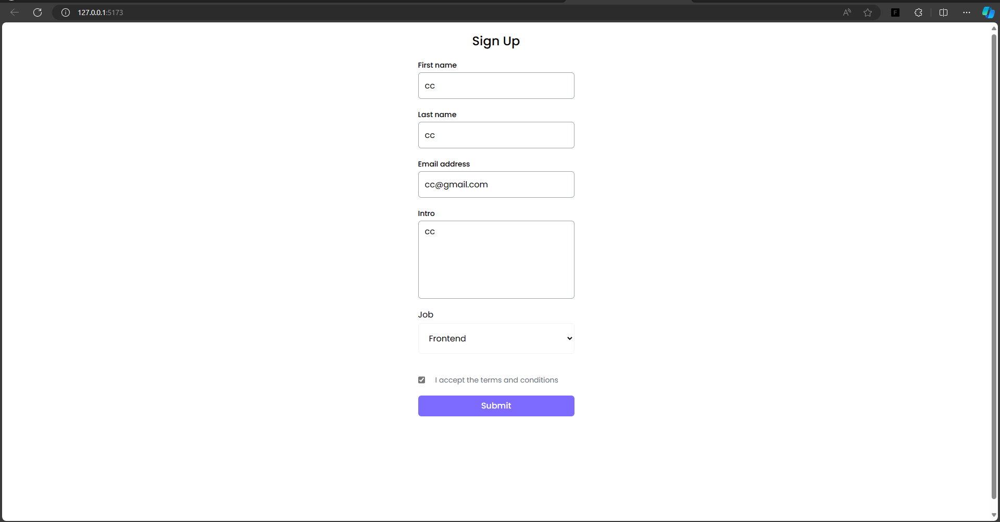

- vite
- node 16.13.0
- React developer tool
- Redux DevToolt

#### Kiến thức cần học

- \* React cơ bản
- \* react hook useState
- \* Styling trong React
- \* React hook useEffect
  - accordion
    
- \* ref và custom hooks
- ##### \* Form

  - Sign up with Formik
    
  - Sign up with React hook Form

- Fragments, Portal

  

- Context và Router

- Redux
- NextJS
